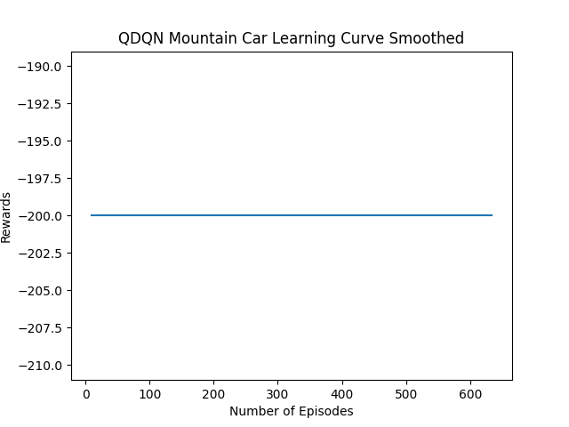

<!-- TOC start -->
- [QHack 2023 ](#qhack-2023)
- [Improving Sample Efficiency in RL: is QPU all you need?](#improving-sample-efficiency-in-rl-is-qpu-all-you-need)
- [Short Introduction](#short-introduction)
- [Motivation](#motivation)
- [Research](#research)
  * [Part I](#part-i)
    + [Overview](#overview)
    + [Implementation Details](#implementation-details)
    + [Experiments](#experiments)
    + [Results](#results)
    + [Conclusions](#conclusions)
  * [Part 2](#part-2)
    + [Overview](#overview-1)
    + [Implementation Details](#implementation-details-1)
    + [Experiments](#experiments-1)
    + [Results](#results-1)
      - [DQN](#dqn)
      - [QDQN](#qdqn)
    + [Conclusions](#conclusions-1)
- [Future Work](#future-work)
- [Summary](#summary)
- [Acknowledgement](#acknowledgement)
- [Copy Right](#copy-right)
- [Team Members](#team-members)
- [References](#references)
<!-- TOC end -->
# QHack 2023 

# Improving Sample Efficiency in RL: is QPU all you need?

# Short Introduction

RL is powerful but inefficient. We explore ways how QC can improve RL. We implement several algorithms, 
train a bunch of agents and compare RL and QRL agents. Lastly, we summarize the results and discuss the limitations and 
future work. 

# Motivation
There have been major breakthroughs in machine learning in the last 10 years that are changing the world right 
now. Many of these achievements were possible in part thanks to reinforcement learning. In particular, the super-human 
level agents playing games ([[4]](#4), [[5]](#5), [[6]](#6)). Even everyone's beloved ChatGpt is trained using RLHF (reinforcement learning 
from human feedback ([[7]](#7), [[8]](#8))). 

However, RL has proven to be brittle. Training is very sensitive to random seed, hyperparameter values and even algorithm implementation details. 
Some of these issues are discussed in detail the following links ([[1]](#1), [[2]](#2), [[9]](#9)). 

One of the biggest problems, that we try to address here, is sample efficiency. RL is notoriously sample inefficient. 
Great effort was put into better learning algorithms (e.g. PPO, DQN algorithms). However, training agents for more challenging 
environments takes months on GPU clusters. In order to make this more scalable and accessible to more people, better 
sample efficiency is needed. There is just so much you can parallelize on a GPU cluster. And this is where quantum 
computing enters the picture. 

The question is simple. Can we achieve faster learning in RL by using QC? 

There are two good reason to try to apply QC in RL. The first reason is that we might be able to process more samples 
in parallel since in some specific cases QC allows for an exponential speed up in runtime. In some RL applications generating 
more data is easy and cheap. Even in the case of off-policy learning, we might be able to process all data quicker. 
We explore this option first. The second direction that we explore is using quantum circuits for function approximation 
with existing RL algorithms. Some QML algorithms have a demonstrated advantage over classic ML algorithms, so we explore 
this option as well. 

To summarize, we first try new quantum algorithms that allow processing data for a RL task in parallel. 
And then we try using QML models with classic RL algorithms hoping for an improvement.

At the moment, one can speed up learning with distributed learning by using vectorized environments. 
Learning updates are then combined in order to update the policy. 
However, even then SOTA (state-of-the-art) models take months to train. 
So what is the advantage that we can achieve if we have access to a QPU?

# Research

## Part I

### Overview

We begin by implementing the QRL algorithm as described in [[3]](#3). 
The advantages and disadvantages are as follows
1. The algorithm offers an exponential speed up by taking an advantage of quantum parallelism
2. We need the same number of qubits as bits to encode the states and actions (no explosion of required resources)
3. The algorithm is practical for environments with small and medium number of states and actions. 
For environments with a huge number of states or actions, we need functional approximation so this method won't work. 
4. In order to obtain the policy distribution, one needs to sample many times. This detail were glossed over. 

### Implementation Details

We implement Q-Learning and QRL algorithms by imitating the structure of the stable-baselines-3 package. 
Implementation has a few hacks due to time constraints, so it shouldn't be used as a guide for best practices.  

The algorithms are implemented in `algorithms.q_learning` and `algorithms.qrl_classic`. 
Code for running the algorithms is in  `experiments.part_1_.*`. 

We also implemented TD-Lambda and compared its performance to Q-Learning (and by extension, QRL).
Code for running the comparison is in `experiments.TD-Lambda vs QLearning.ipynb`.

### Experiments

We train the agents using these algorithms on the `Frozen Lake` environment using 
the well-known `gym` package. We train agents on a `slippery` and `non-slippery` variations 
of this environment. `non-slippery` environment is deterministic and can be learned 
exactly. That is what our agents achieve. This environment is similar to the grid-world 
environment used in the paper ([[3]](#3)). Meanwhile `non-slippery` is a non-deterministic 
environment, and there is no policy that can achieve a perfect score. 
We do some hyperparameter optimization, but not extensive. 
We fix the map size and create 10 different maps for the environment. For each map we train 
an agent using q-learning and qrl. We plot the learning curves during the training period below 
(x-axis is a number of steps taken in the environment and y-axis is a reward in the evaluation environment 
over 100 runs, note that the training and evaluation environments are the same).

Note that the reward structure in this environment is that the agent receives 1 if it reaches 
the goal and all other rewards are zero (this is in contracts to some environments where 
each step yields a small negative reward). 

First, let us consider the deterministic setting. Q-learning agent sometimes doesn't converge. 
This is in part caused by the fact that there is a decay parameter that reduces the learning rate 
with each episode. This is needed in order for the distribution to converge, otherwise the agent's 
learning might remain unstable. it is likely that with a more extensive hyperparameter optimization we can 
obtain parameters that lead to more consistent training. 
On the other hand, QRL agent doesn't have this parameter, and once it finds a step that leads to the goal, 
it updates the probability of this action to 1. 

Second, let us consider the non-deterministic setting. Due to the non-deterministic 
nature of the environment, we do not expect the agent to find a consistent solution 
in general (even though that is possible for some specific configurations). 
We use 100 episodes for a single evaluation, which might not be consistent due to the 
stochastic nature of the environment. We see that the results of individual runs 
are very different, and that is the reason why we include several configs. However, 
one thing is clear, on average QL outperforms QRL. Better results might be obtained with more 
hyperparameter tuning, but as we discuss in the next section, 
we actually expect QRL to converge very quickly and sometimes get stuck with the suboptimal actions, 
because the update rule increases the probability of even slightly better actions immediately to 1. 

### Results

The paper introducing QRL ([[3]](#3)) has many flaws and the proposed algorithm is of no practical use. 
It has the right idea of using quantum parallelism. 
However, the proposed algorithm doesn't utilize this quantum parallelism in a useful way. 
As we detail below, there is no need to use a quantum circuit and the quantum part of the algorithm 
can more efficiently be replaced by matrix multiplication.

In particular, the algorithm is a variation of a TD-lambda algorithm. It has the value function 
exactly as in the TD-lambda algorithm. 
The agent interacts with the environment in a classic way by taking a single action at a time. 
Where it does differ from TD-lambda is in the policy update step. 
Actions distribution for a given state (`f(s) = |a>`) are updated using quantum amplitude amplification, 
inspired by Grover's algorithm. This step is really an unnecessary complication. 
Grover's algorithm is used for finding elements marked by an oracle, an oracle which we don't know. 
Then by measuring the output of the circuit only few times (in best case scenario only once), we immediately 
find the element marked by the oracle. 
In this case, we know exactly the element (in this case action) we are considering. 
So we can write down the matrices for the amplitude amplification and get the same results at the same speed by 
using matrix multiplication.

There is a huge problem with this policy update rule. 
The update rule for the state-action function doesn't work well for environments with very few actions. 
Amplitude amplification works by flipping all state values around the mean. So the minimum rotation angle depends on the total number of actions. 
In the case of four actions with equal probabilities, a single amplitude amplification will update the distribution to a distribution 
where one of the actions will have probability one. 

However, there is actually even a bigger problem with this policy update rule. 
There is an asymmetry, in that state-action function is only updated when we find good actions with better value. 
If we encounter bad actions, we don't update the state-action function. 
This is a major disadvantage since at the beginning the algorithm might amplify suboptimal actions, which won't be corrected for a long time. 
And this is exactly what we observed in some cases, most clearly in the non-deterministic environments. 
In particular, in non-deterministic environments, first accidental good action will amplify this action to 
probability 1, even though on average this action might be detrimental. 

The last problem is with the grid-world problem that was used for experiments. There is a simple reason why this algorithm 
works for this environment, that follows from the points discussed above. First, an agent in this environment has four actions. 
As explained above, if we find an action that leads to bigger value, amplitude amplification will update the probability of this action to a value close to one. 
And for the grid-world environment that is basically what we want, since that is a quick way that leads to a path from start to the goal. 
One can achieve a similar effect by modifying epsilon-greedy policy in TD-lambda. 

### Conclusions

The QRL as proposed in ([[3]](#3)) is an interesting variation of Q-learning. 
However, the paper significantly overplays the role of quantum parallelism in this algorithm. 
It is more accurate to describe QRL as quantum-inspired and after closer inspection the algorithm 
is actually significantly worse than the standard Q-learning. 
Hence, in order to fully take the advantage of quantum computing for reinforcement learning 
different algorithms are needed. And that is what we explore next

## Part 2

### Overview

Now we take a different approach. 
We use quantum algorithms for functional approximation for deep q-learning. 
There is an implementation of variational quantum algorithm for DQN ([[13]](#13)) 
called Quantum Deep Q-learning algorithm (`QDQN`) that we use. 
We extend on this work by running hyperparameter optimization, 
comparing the learning rates with DQN and finally by applying the same 
algorithm to a new environment. 

### Implementation Details

We use 
[stable-baselines3](https://stable-baselines3.readthedocs.io/en/master/), 
[gym](https://www.gymlibrary.dev/),
[optuna](https://optuna.org/) and
[qrl-dqn-gym](https://github.com/qdevpsi3/qrl-dqn-gym) 
packages. Due to the time constraint, we hack things together.

We ran the experiments on the `cyxtera` platform. We exploited `NVIDIA cuQuantum SDK` by using `PennyLane-Lightning-GPU` plugin ([[10]](#10)). 

Relevant code is in `experiments.part_2_.*`. 

### Experiments
To begin with, we again use the 
[Frozen Lake](https://www.gymlibrary.dev/environments/toy_text/frozen_lake/) 
environment provided by the gym package in part to see how these models compare with the 
tabular algorithms considered in the first part. For the classic RL algorithm, we use 
[DQN](https://stable-baselines3.readthedocs.io/en/master/modules/dqn.html) 
agent as implemented in stable-baselines-3. For hyperparameter optimization we use 
[optuna](https://optuna.readthedocs.io)
. In particular, we use 
[median](https://optuna.readthedocs.io/en/stable/reference/generated/optuna.pruners.MedianPruner.html#optuna.pruners.MedianPruner) 
pruner that at set intervals, drops trial configurations that are worse than the median result of all trial runs so far. 
We carry out hyperparameter optimization in order to get fairer results, since in the end we want to compare the 
learning rate and the final performance of different algorithms. 

We also pick another gym environment because we want to see how results compare across the environments. 
The second environment we pick is [Mountain Car](https://www.gymlibrary.dev/environments/classic_control/mountain_car/). 
The interesting feature of this environment is that the agent must learn to  push the car in the opposite direction 
then the goal is, in order to reach the goal. 
This environment wasn't considered in the original `QDQN` paper ([[13]](#13)).    

Even using hardware acceleration available to us, training of `QDQN` agents is very slow. 
Hence, we don't do an extensive hyperparameter optimization and instead pick the training 
parameters based on the findings in ([[13]](#13)). Moreover, MountainCar environment has 2 inputs 
and 3 outputs (CartPole is 4 and 2 and FrozenLake is 16 and 4), so we add a single linear layer to 
the architecture used for CartPole. We didn't want to add more linear layers since we are 
really trying to explore the capabilities of QNN. 

### Results

Trained agents have been uploaded to hugging face and can be accessed via the following links

| Model | Environment  |                                               Link |
|-------|:------------:|---------------------------------------------------:|
| DQN   | Frozen Lake  |   https://huggingface.co/agercas/dqn-FrozenLake-v1 |
| DQN   | Mountain Car |  https://huggingface.co/agercas/dqn-MountainCar-v0 |
| PPO   | Frozen Lake  |   https://huggingface.co/agercas/ppo-FrozenLake-v1 |
| PPO   | Mountain Car |  https://huggingface.co/agercas/ppo-MountainCar-v0 |
| QDQN  | Frozen Lake  |  https://huggingface.co/agercas/qdqn-FrozenLake-v1 |
| QDQN  | Mountain Car | https://huggingface.co/agercas/qdqn-MountainCar-v0 |

(Note that we couldn't generate video player previews because we were using modified 
environments to train the agents, and the scripts for uploading agents couldn't generate videos.)

#### DQN

We develop `QDQN` agents by modifying and extending the code in [qrl-dqn-gym](https://github.com/qdevpsi3/qrl-dqn-gym) package. 
Below we plot the learning curves while using DQN algorithm in the frozen lake environment. 
Left graph shows Optuna study results. Right graph shows the learning curve for a single training run. 
The learning curve is constructed by evaluating the performance of an agent every 1000 timesteps by 
running the agent on an evaluation environment 100 times and averaging the reward. We see that it takes 
the DQN agent longer to learn than QL or QRL agent. The performance is better than QRL agent but worse than 
that of QL agent. So either DQN is not the right algorithm for this policy or we just haven't found a good 
hyperparameter configuration. 

[//]: # "![DQN Frozen Lake Learning Curve Smooth]&#40;./images/dqn_learning_curve_frozen_lake.png&#41;"
[//]: # "![DQN Frozen Lake Optuna Optimization]&#40;./images/dqn_optuna_opt_frozen_lake_default.png&#41;"

  
  

Below are the same training graphs when using PPO algorithm. Left graph shows optuna study trials
(each dot is a different trial and the red line tracks the best found configuration yet). 
The right graph shows the learning curve while training an agent. We see that PPO converges quicker than 
DQN and mean value is higher than DQN. The mean value is comparable to Q-learning results. 

  
  

DQN Mountain Car Training Results

  
  

PPO Moutain Car Training Results

  
  

In all cases the agent training converged. In the Frozen Lake environment the agents showed almost linear 
improvement at the beginning and then plateaued. In the Mountain Car environment the convergence 
is much more uncertain. However, in the end it does look like the agents converged to a good 
configuration. Based on what we know about the environments, in particular, that Mountain Car environment 
is trickier, but deterministic, the results are in line with expectations. These results also 
provide some sense on the convergence speed of different algorithms. 

#### QDQN

Finally, we discuss the results of training `QDQN` agents. 

First, we trained a `QDQN` agent on a `FrozenLake-v1` environment for 5k episodes which took us 8 hours on 
a `NVIDIA A100` GPU with `cuStateVec` library enabled. 
Number of seconds it took to process a single episode varied from 3s to 50s. The training results are 
visually presented below.

QDQN Frozen Lake Training Summary.  
We evaluate the agent every 20 episodes, and we run it 5 times on the evaluation environment. 
Reward is an average reward on the evaluation environment (each run has reward 1 if we reach the end, and 0 if not). 
Steps show the number of steps taken in a given episode. 
Epsilon is the probability of exploration. 

  

  

Now these results clearly show that our agent hasn't learned much if anything. 
The main problem appears to be the fact that epsilon (exploration probability) 
decayed way too quickly. 

So how did the authors of the paper ([[13]](#13)) obtain the convergence in the same 
environment by training for the same number of episodes? 

  

Well, we used `FrozenLake-v1` and the authors of the paper used `FrozenLake-v0`. 
The difference between versions is only [bug fixes](https://github.com/openai/gym/pull/2619), default environment 
values are the same. We suspect (emphasis on suspect, because glancing at the paper it wasn't clear) 
that the authors used a deterministic version of Frozen Lake. This would be indeed inline with 
the convergence rates we observed in the first part when using ql and qrl. 
We also expect that the hyperparameters values (in particular, the decay rate of epsilon) are especially a complete 
over-fit for this environment. 
In this case, we would have mistakenly trained the agent on an effectively much more difficult environment 
(which was our intention after all). 

What is clear that lower decay rate is necessary, and ideally we would have a chance to carry out hyperparameter optimization. 
However, it takes quite a while to train the agent, so we leave these explorations for future work. 

Now let us take a look at the agent trained in the `MountainCar-v0` environment. 
We trained the agent only for 600 episodes which took us 5 hours on a `NVIDIA A100` GPU with `cuStateVec` library enabled. 
Number of seconds it took to process a single episode varied from 20s to 60s. 
Training of this model appears to have been significantly slower than that in `FrozenLake-v1` 
environment. One reason is that the QNN model is bigger, as we had layers for the input and output. 
Also, we had to add a linear layer to convert from input space (size 2) to output space (size 3). 
The training results are visually presented below. It is pretty clear that the agent didn't learn 
anything. Again the problem seems to be the fact that exploration rate drops very sharply. 
However, this probably also indicates a problem with the model architecture, that either 
that it has a bug or it is just not suitable for this task. 

  

  

### Conclusions

Training Quantum Machine Learning algorithms is hard and takes a lot of time. 
More experiments are needed in order to better understand when and why QDQN works and doesn't. 
We only explored using Quantum Neural Net for these tasks, and there are many other proposed 
quantum algorithms. We couldn't get QNNs to converge in a reasonable amount of time, whereas training 
NNs was easy (thanks to all the available packages and integrations). 

# Future Work

We barely scratched the surface of available quantum (and quantum inspired) algorithms for RL applications. 
There are many other algorithms discussed in literature that might be of interest which we didn't have time to explore. 
One future direction is to carry out a more extensive survey of the available algorithms and summarize their advantages 
and disadvantages. 

Another direction, similar to the above, is to work on a package (or packages) of standardized 
quantum algorithms (for RL or any other applications), that would allow for an easier plug-and-play research, 
development and benchmarking. 

For the discrete problems, better formulation of the RL problem in terms of quantum terms is needed. 
So far proposed uses of QC for discrete RL problems don't take the advantage of possible exponential quantum 
speed up. 

For the continuous problems, we only tried using Quantum Neural Net ([QNN](https://en.wikipedia.org/wiki/Quantum_neural_network)). 
And we observed that ML algorithms (DQN and PPO) significantly outperform QML algorithms 
(both in convergence speed as measured in environment steps and 
training time per episode measured in seconds). 
Deep learning is very effective ([[15]](#15)) which to large part is due to the numerous people working in the filed. 
And to some extent the success of DL can be credited to the availability of hardware ([[16]](#16)) as 
the algorithms are highly optimized to run efficiently on GPUs. 
For QML to reach the same level of efficiency much more work and time is needed. 
New quantum algorithms should be proposed and considered even if they don't immediately outperform 
classic algorithms, as progress will most likely be incremental.

Finally, we shouldn't forget that the [Bennet's laws](https://en.wikipedia.org/wiki/Bennett%27s_laws) 
of quantum information state that a qubit "can do more job" than a bit. 
Hence, we are confident that QML algorithms will outperform ML algorithms. 

# Summary

Our contributions can be summarized as follows
1. We implemented q-learning and quantum-reinforcement-learning (qrl) algorithms
   1. We tested and compared these algorithms in a deterministic and non-deterministic environments 
   2. We reviewed in detail the qrl algorithm and its advantages and disadvantages
2. We extended the analysis of quantum deep q-learning algorithm (QDQN)
   1. We trained QDQN agents on two environments (one previously considered in the paper and the other one new)
   2. We compared the learning rates for DQN and QDQN
   3. We compared the training speeds by using Nvidia's cuQuantum SDK

# Acknowledgement

We want to thank the organizers of [QHack 2023](https://qhack.ai/) for this amazing competition.

And we want to thank [NVIDIA](https://www.nvidia.com) for providing the computation resources, 
without which we couldn't have gotten the results out in time. 

# Copy Right
We built many things on the code provided in the package documentations and tutorials. 
We tried to provide links to original sources everywhere. 
If we failed to give credit where appropriate, we will happily add the missing references. 

# Team Members

* [agercas](https://github.com/agercas)
* [ichirokira](https://github.com/ichirokira)
* [jackyruth](https://github.com/jackyruth)
* [suniverse](https://github.com/suniverse)

# References
<a id="1">[1]</a> 
Deep Reinforcement Learning Doesn't Work Yet. 
Irpan, A. (2018).
[rl-hard](https://www.alexirpan.com/2018/02/14/rl-hard.html)

<a id="2">[2]</a> 
Enhancing Sample Efficiency in Reinforcement Learning with Nonparametric Methods. 
A Nonparametric Off-Policy Policy Gradient. 
Tosatto, S. et al. (2020) 
[Nvidia Developer Blog](https://developer.nvidia.com/blog/enhancing-sample-efficiency-in-reinforcement-learning-with-nonparametric-methods/) 
[arxiv:2001.02435](https://arxiv.org/abs/2001.02435)

<a id="3">[3]</a> 
Quantum Reinforcement Learning. 
Dong et al. (2008).
[arXiv:0810.3828](https://arxiv.org/abs/0810.3828)

<a id="4">[4]</a> 
Mastering the game of Go with deep neural networks and tree search.
Silver, D. et al. (2016) 
[Nature 529, 484–489 (2016)](https://doi.org/10.1038/nature16961)

<a id="5">[5]</a> 
Grandmaster level in StarCraft II using multi-agent reinforcement learning.
Vinyals, O. et al. (2019)
[Nature 575, 350–354 (2019)](https://doi.org/10.1038/s41586-019-1724-z)

<a id="6">[6]</a> 
Human-level play in the game of Diplomacy by combining language models with strategic reasoning. 
Bakhtin, A. (2022) 
[SCIENCE 22 Nov 2022 Vol 378, Issue 6624](https://doi.org/10.1126/science.ade9097)

<a id="7">[7]</a>
Language Models are Few-Shot Learners 
Brown, B. T et al. (2020) 
[arXiv:2005.14165](https://arxiv.org/abs/2005.14165) 

<a id="8">[8]</a> 
ChatGPT: Optimizing Language Models for Dialogue 
OpenAI 
[ChatGPT announcement](https://openai.com/blog/chatgpt/)

<a id="9">[9]</a> 
Reinforcement learning: An introduction 
Sutton, R. S., & Barto, A. G. (2018) 
[book](http://www.incompleteideas.net/book/the-book-2nd.html)  

<a id="10">[10]</a> 
Lightning-fast simulations with PennyLane and the NVIDIA cuQuantum SDK. 
Lee J. O'Riordan (2022) 
[pennylane announcement blog](https://pennylane.ai/blog/2022/07/lightning-fast-simulations-with-pennylane-and-the-nvidia-cuquantum-sdk/)

<a id="11">[11]</a> 
Parametrized Quantum Circuits for Reinforcement Learning. 
Tensorflow resources. 
[tutorial](https://www.tensorflow.org/quantum/tutorials/quantum_reinforcement_learning)

<a id="12">[12]</a> 
Parametrized quantum policies for reinforcement learning 
Jerbi, S. et al (2021) 
[arXiv:2103.05577](https://arxiv.org/abs/2103.05577) 

<a id="13">[13]</a> 
Quantum agents in the Gym: a variational quantum algorithm for deep Q-learning 
Skolik, A. et al (2021) 
[arXiv:2103.15084](https://arxiv.org/abs/2103.15084) 

<a id="14">[14]</a> 
Data-reuploading classifier
Ahmed, S. (2019)
[pennylane demo](https://pennylane.ai/qml/demos/tutorial_data_reuploading_classifier.html)

<a id="15">[15]</a> 
The Unreasonable Effectivness Of Deep Learning
Yann LeCun (2014)
[lecture series](https://www.cs.tau.ac.il/~wolf/deeplearningmeeting/pdfs/lecun-20141105-tau-intel-master-class.pdf)

<a id="16">[16]</a> 
The Hardware Lottery 
Hooker, S. (2020) 
[arXiv:2009.06489](https://doi.org/10.48550/arXiv.2009.06489) 
